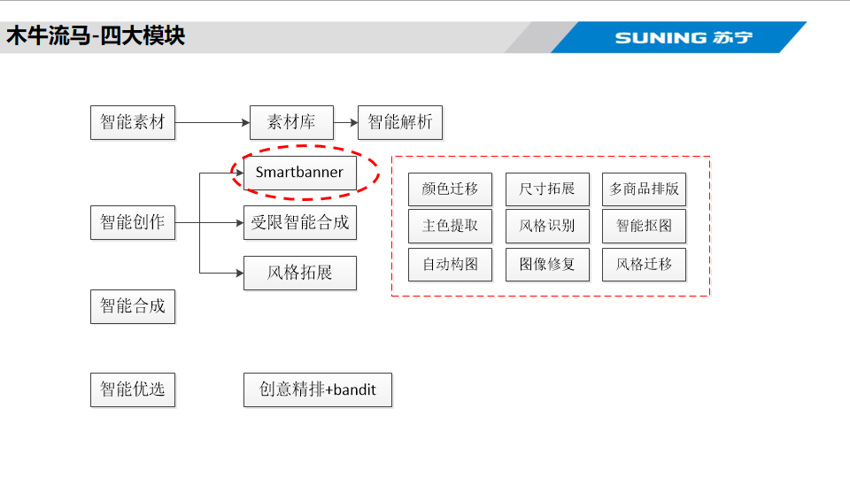
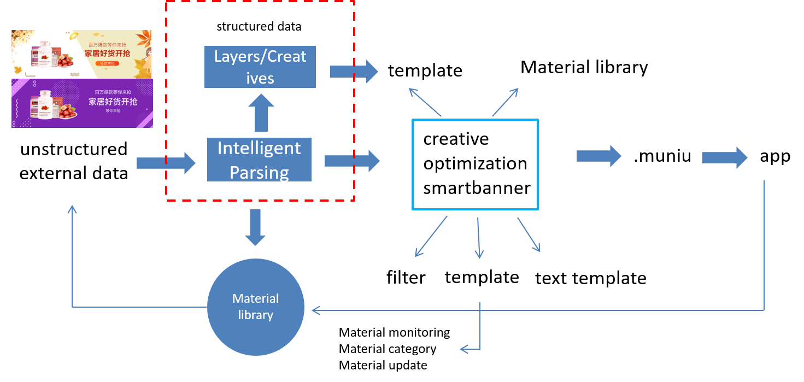
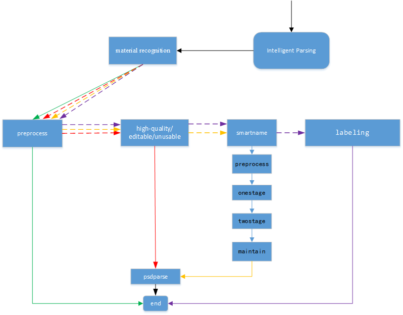
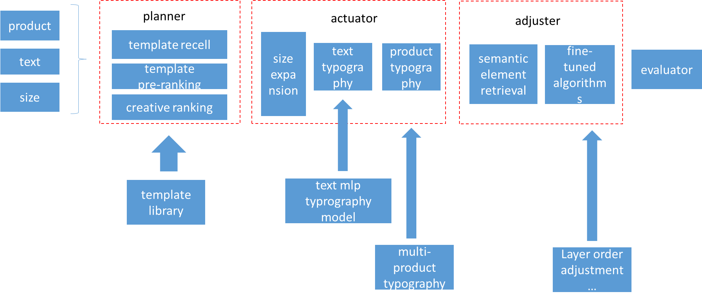
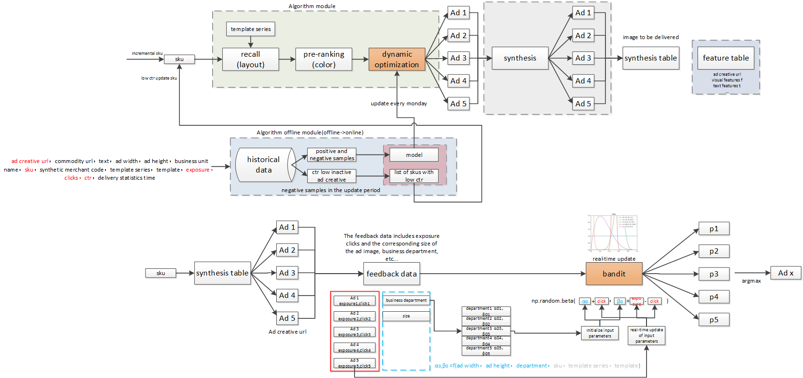
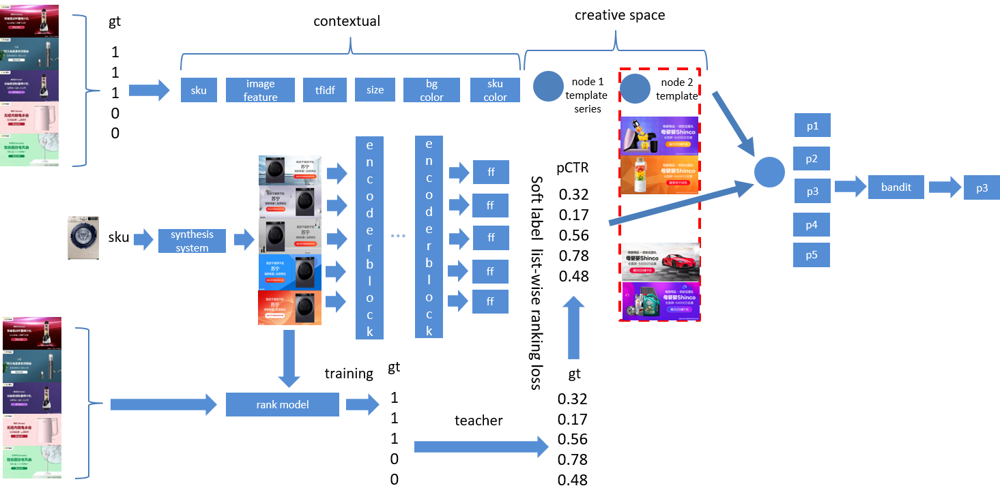

## Intelligent Creative Platform 
iwogh is an internal creative design platform at Suning, which includes three main modules: intelligent parsing, intelligent creation, and intelligent optimization. It also encompasses a series of real-time creative tools, providing comprehensive support for Suning's creative business.

    

### Intelligent Parsing

    

    

[arixv]()      
In the industrial e-commerce landscape, creative designs such as banners and posters are ubiquitous. Extracting structured semantic information from creative e-commerce design materials (manuscripts crafted by designers) to obtain design semantics represents a core challenge in the realm of intelligent design. In this paper, we propose a comprehensive automated framework for intelligently parsing creative materials. This framework comprises material recognition, preprocess, smartname, and label layers. The material recognition layer consolidates various detection and recognition interfaces, covering business aspects including detection of auxiliary areas within creative materials and layer-level detection, alongside label identification. Algorithmically, it encompasses a variety of coarse-to-fine methods such as Cascade RCNN, GFL, and other models. The preprocess layer involves filtering creative layers and grading creative materials. The smartname layer achieves intelligent naming for creative materials, while the label layer covers multi-level tagging for creative materials, enabling tagging at different hierarchical levels. Intelligent parsing constitutes a complete parsing framework that significantly aids downstream processes such as intelligent creation, creative optimization, and material library construction. Within the practical business applications at Suning, it markedly enhances the exposure, circulation, and click-through rates of creative materials, expediting the closed-loop production of creative materials and yielding substantial benefits.

### Smartbanner   

    

[arixv]()    
Companies use banners extensively to promote their products, and the intelligent automatic synthesis of banners is a challenging event. Under the premise of inputting only a small amount of information such as product, text and size, it can synthesize styles with high freedom and richness, but at the same time, it must satisfy the design specifications of advertisers for advertising and scenes. We propose an intelligent banner design framework that strikes a balance between creative freedom and design rules, called smartbanner. Smartbanner consists of planner, actuator, adjuster and generator. The banner is synthesized through the combined framework, which fully liberates the designer and reduces the threshold and cost of design. It increases the click-through rate by 30%, improves the human efficiency of designers by 500% under the condition of ensuring the quality of creation, and synthesizes hundreds of millions of pictures in batches throughout the year.

### ADCT

    

    

[arixv](https://arxiv.org/abs/2312.01295)     
Ad creative is one of the main mediums for e-commerce advertising. Ad creative with good visuals may increase a product's click-through rate(ctr). In recent years, unlike artificially produced ad creatives, advertising platforms can automatically synthesize ad creatives, and each type of element can be arbitrarily specified. Advertisers only need to provide basic materials to synthesize a large number of potential ad creatives in batches. But with limited real-time feedback, it is difficult to accurately estimate the ctr of creatives. In our scenario, in addition to a large number of sparse samples, we also face the problem of ambiguous samples. In our approach we decouple this dynamic creative optimization into two stages, a cascaded structure that can trade off between effectiveness and efficiency. In the first stage, we train an automatic creative optimization architecture based on autoco[5] to simulate complex interactions between creative elements. Although we obtained the ranking of different creatives under a sku, because we bucketed and merged historical data according to periods, this confuses the ctr diversity of the same ad creatives on different days and weakens the ability to separate ambiguous samples. Therefore, we propose a transformer-based rerank model. With the help of the rank model, we propose a distillation method to learn the relative order of ideas and extract the ranking knowledge to guide the rerank learning. The creative order soft labels under each sku are generated by the rank model to alleviate the dilemma that a large number of under-represented creatives cannot obtain real labels. Through the knowledge diffusion of rerank, the ambiguous samples are associated with the positive and negative samples. Cascade rerank and autoco to output the estimated value of the synthetic ad image. In the second stage, we designed a bandit model, and the bandit selected one of the output ad of the first stage for timely delivery. Experimental results show that our method can outperform competing baselines in terms of sctr. Online A/B testing shows that our method improves ctr by 10% compared to the baseline.

## OCR  
### Detection/Recognition/Evaluation/deploy

### Tampler detection

## 

